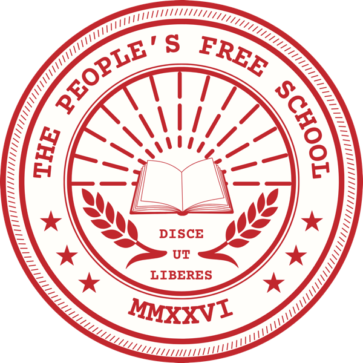

_A model for adults to study together. Free to use, adapt, and share._

The People's Free School is an open, adoptable model for collective adult political education. It draws on the folk school tradition of Myles Horton and the critical pedagogy of Paulo Freire. There are no professors and no students in the usual sense. Everyone in the room is both a learner and a teacher. The curriculum is shaped by the people who show up.

This site contains everything you need to start a school in your community: the principles the school operates by, the methods that make it work, a growing library of readings and other materials, and templates for running sessions.

**New here? Start with the [[01-founding-statement|Founding Statement]].**

## What's here

- [[01-start-here/index|Start here]]: Founding statement, pedagogy, and the guide to starting a school in your community
- [[03-themes/index|Themes]]: The thematic resource library, organized around the themes that anchor the school's work
- [[02-session-templates/index|Session templates]]: Plug-and-play structures for single sessions, multi-week study circles, and weekend intensives
- [[04-resources/index|Resources]]: Indexes of readings, podcasts, films, and primary sources, organized by author and format
- [[school-index|Index]]: A back-of-book index of the people, topics, and organizations across the school, pointing to where each appears
- [[05-examples/index|Examples]]: Case studies from groups that have used the model

## License

The People's Free School is licensed under a [Creative Commons Attribution-ShareAlike 4.0 International License](https://creativecommons.org/licenses/by-sa/4.0/). You are free to share and adapt the material, including commercially, as long as you give attribution and keep the same license.

## Contact

[Derron Borders, Developer](https://www.dialecticalpraxis.com/#contact)
